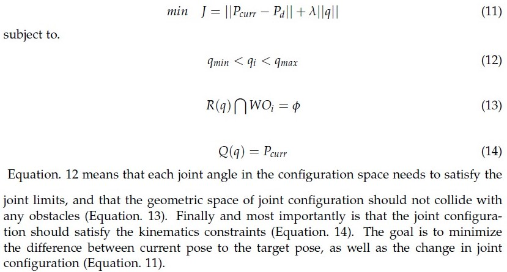
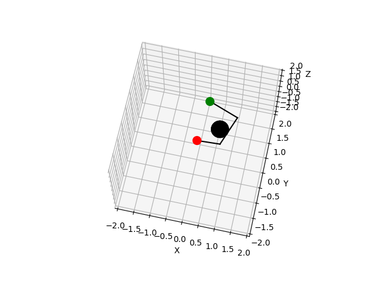

# Kinematic Transformation and Inverse Kinematics

Forward Kinematics is a mapping from configuration space to a family of Lie Group. By using kinematic equations, we can compute the position of the robot’s end-effectors from the joint parameters. 

Inverse Kinematics is a mapping from a particular Lie Group to configuration space that makes use of the kinematics equations to determine the joint parameters that provide a desired position for each of the robot’s end-effectors and meanwhile satisfies a set of constraints. It’s often impractical to calculate closeform solution based on geometrics, therefore the problem is formulated as a numerical optimization problem with the following objective:

the forward kinematics is implemented in file *fk.py*, the inverse kinematics is implemented in file *IK.py*. An example is shown below, where black lines represent a planar robot with 3 rotational joints that extends from red point, tries to reach the green goal, and avoid collision with the black obstacle.
